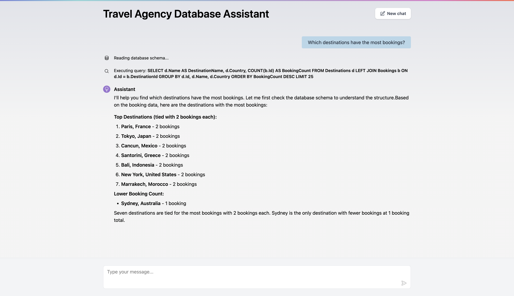

# Equibles.AgentQL



Reusable .NET library that translates EF Core `DbContext` models into LLM-friendly schema descriptions and provides safe SQL query execution. Enables LLMs to understand your database structure and query it via function calling.

## Overview

AgentQL sits between your EF Core database and any AI provider (OpenAI, Anthropic, Ollama). It:

1. **Introspects** your EF Core model — tables, columns, types, relationships, enums, inheritance — and produces a text description the LLM can reason about.
2. **Executes** SQL queries safely inside transactions with configurable row limits, timeouts, and read-only enforcement.
3. **Exposes** three LLM tool functions (`GetDatabaseSchema`, `ExecuteQuery`, `ReportFailure`) through [Microsoft.Extensions.AI](https://learn.microsoft.com/en-us/dotnet/ai/ai-extensions), so any compatible chat client can call them automatically.

## Getting Started

Install the NuGet packages:

```bash
dotnet add package Equibles.AgentQL.MicrosoftAI        # Includes Core + EF Core
# — or, if you don't need the AI layer —
dotnet add package Equibles.AgentQL.EntityFrameworkCore  # Schema + query only
```

Minimal setup:

```csharp
builder.Services.AddDbContext<MyDbContext>(o => o.UseSqlite("DataSource=app.db"));

builder.Services.AddAgentQLChat<MyDbContext>(configureChat: options =>
{
    options.Provider = AiProvider.OpenAI;
    options.ApiKey = "sk-...";
    options.ModelName = "gpt-4o";
});
```

That's it — `ISchemaProvider`, `IQueryExecutor`, `AgentQLPlugin`, and `IChatClient` are all registered and ready for DI.

## Full Example

```csharp
using Equibles.AgentQL.MicrosoftAI;
using Equibles.AgentQL.MicrosoftAI.Configuration;
using Equibles.AgentQL.MicrosoftAI.Extensions;
using Microsoft.EntityFrameworkCore;
using Microsoft.Extensions.AI;
using Microsoft.Extensions.DependencyInjection;

var services = new ServiceCollection();

services.AddDbContext<MyDbContext>(o => o.UseSqlite("DataSource=app.db"));

services.AddAgentQLChat<MyDbContext>(
    configureAgentQL: agentQL =>
    {
        agentQL.MaxRows = 50;
        agentQL.ReadOnly = true;
        agentQL.CommandTimeout = 30;
    },
    configureChat: chat =>
    {
        chat.Provider = AiProvider.OpenAI;
        chat.ApiKey = Environment.GetEnvironmentVariable("OPENAI_API_KEY");
        chat.ModelName = "gpt-4o";
    });

var sp = services.BuildServiceProvider();

using var scope = sp.CreateScope();
var chatClient = scope.ServiceProvider.GetRequiredService<IChatClient>();
var plugin = scope.ServiceProvider.GetRequiredService<AgentQLPlugin>();

var chatOptions = new ChatOptions { Tools = [.. AIFunctionFactory.Create(plugin)] };
var messages = new List<ChatMessage> { new(ChatRole.System, "You are a helpful database assistant.") };

while (true)
{
    Console.Write("You: ");
    var input = Console.ReadLine();
    if (string.IsNullOrEmpty(input)) break;

    messages.Add(new ChatMessage(ChatRole.User, input));
    var response = await chatClient.GetResponseAsync(messages, chatOptions);
    messages.AddRange(response.Messages);

    Console.WriteLine($"Assistant: {response}");
}
```

## Configuration

### AgentQLOptions

Passed via `configureAgentQL` when calling `AddAgentQL` or `AddAgentQLChat`:

| Property | Type | Default | Description |
|----------|------|---------|-------------|
| `MaxRows` | `int` | `25` | Maximum rows returned per query |
| `ReadOnly` | `bool` | `true` | When true, queries run inside a rolled-back transaction |
| `CommandTimeout` | `int` | `15` | SQL command timeout in seconds |
| `DefaultBehavior` | `IncludeBehavior` | `IncludeAll` | Whether entities/properties are included or excluded by default |

### AgentQLChatOptions

Passed via `configureChat` when calling `AddAgentQLChat`:

| Property | Type | Default | Description |
|----------|------|---------|-------------|
| `Provider` | `AiProvider` | `OpenAI` | AI provider (`OpenAI`, `Anthropic`, `Ollama`) |
| `ApiKey` | `string` | — | API key for the provider |
| `Endpoint` | `string` | — | Custom endpoint URL (auto-resolved per provider if omitted) |
| `ModelName` | `string` | — | Model identifier (e.g. `gpt-4o`, `claude-sonnet-4-20250514`) |
| `MaxOutputTokens` | `int` | `4096` | Maximum tokens in the AI response |
| `SystemPrompt` | `string` | *(built-in)* | System prompt sent to the LLM |

## Attributes

### `[AgentQLEntity]`

Apply to entity classes to set descriptions or change the default property inclusion:

```csharp
[AgentQLEntity(Description = "Customer orders", PropertyDefault = IncludeBehavior.ExcludeAll)]
public class Order
{
    public int Id { get; set; }

    [AgentQLProperty(Description = "Total in USD")]
    public decimal Total { get; set; }

    public string InternalNotes { get; set; } // excluded by PropertyDefault
}
```

### `[AgentQLProperty]`

Apply to properties to add descriptions visible to the LLM:

```csharp
[AgentQLProperty(Description = "ISO 4217 currency code")]
public string Currency { get; set; }
```

### `[AgentQLIgnore]`

Exclude a property from the schema regardless of other settings:

```csharp
[AgentQLIgnore]
public string PasswordHash { get; set; }
```

## Fluent API

Configure inclusion/exclusion in code instead of (or in addition to) attributes:

```csharp
builder.Services.AddAgentQLChat<MyDbContext>(configureAgentQL: options =>
{
    // Exclude an entire entity
    options.Entity<AuditLog>().Exclude();

    // Include an entity and configure individual properties
    options.Entity<Customer>(e =>
    {
        e.Include();
        e.Description = "Registered customers";
        e.Property<Customer>(c => c.Email).Include();
        e.Property<Customer>(c => c.Ssn).Exclude();
    });
});
```

## Include/Exclude Hierarchy

Each level overrides the one above it:

1. **Context-level** — `AgentQLOptions.DefaultBehavior` (`IncludeAll` or `ExcludeAll`)
2. **Entity-level** — `Entity<T>().Include()` / `.Exclude()` or `[AgentQLEntity]`
3. **Property-level** — `Property().Include()` / `.Exclude()`, `[AgentQLProperty]`, or `[AgentQLIgnore]`

Primary keys and discriminator columns are always included regardless of configuration.

## AI Providers

### OpenAI

```csharp
configureChat: options =>
{
    options.Provider = AiProvider.OpenAI;
    options.ApiKey = "sk-...";
    options.ModelName = "gpt-4o";
}
```

### Anthropic

```csharp
configureChat: options =>
{
    options.Provider = AiProvider.Anthropic;
    options.ApiKey = "sk-ant-...";
    options.ModelName = "claude-sonnet-4-20250514";
}
```

### Ollama

```csharp
configureChat: options =>
{
    options.Provider = AiProvider.Ollama;
    options.Endpoint = "http://localhost:11434"; // default
    options.ModelName = "llama3";
}
```

## Using Without the AI Layer

If you only need schema introspection and query execution (no chat client):

```csharp
builder.Services.AddDbContext<MyDbContext>(o => o.UseSqlite("DataSource=app.db"));

builder.Services.AddAgentQL<MyDbContext>(options =>
{
    options.MaxRows = 100;
    options.ReadOnly = true;
});

// Then inject ISchemaProvider and IQueryExecutor wherever needed:
public class MyService
{
    private readonly ISchemaProvider _schema;
    private readonly IQueryExecutor _query;

    public MyService(ISchemaProvider schema, IQueryExecutor query)
    {
        _schema = schema;
        _query = query;
    }

    public async Task<string> GetSchema() => await _schema.GetSchemaDescription();

    public async Task<QueryResult> RunQuery(string sql) => await _query.Execute(sql);
}
```

## Docker

Build and run the demo app in a container:

```bash
docker build -t agentql-demo .
docker run -p 8080:8080 \
  -e AgentQL__Provider=OpenAI \
  -e AgentQL__ApiKey=sk-... \
  -e AgentQL__ModelName=gpt-4o \
  agentql-demo
```

Available environment variables:

| Variable | Description |
|----------|-------------|
| `ConnectionStrings__DefaultConnection` | SQLite connection string (default: `DataSource=travel.db`) |
| `AgentQL__Provider` | `OpenAI`, `Anthropic`, or `Ollama` |
| `AgentQL__ApiKey` | API key for the chosen provider |
| `AgentQL__Endpoint` | Custom API endpoint URL |
| `AgentQL__ModelName` | Model name (e.g. `gpt-4o`, `claude-sonnet-4-20250514`) |

## Demo App

The included demo is a Blazor Interactive Server app simulating a travel agency chat interface. It uses a SQLite database (`travel.db`) that auto-seeds on first run.

```bash
dotnet run --project Equibles.AgentQL.Demo
```

Open `http://localhost:5143` in your browser. Configure your AI provider in `Equibles.AgentQL.Demo/appsettings.json`:

```json
{
  "AgentQL": {
    "Provider": "OpenAI",
    "ApiKey": "sk-...",
    "ModelName": "gpt-4o"
  }
}
```

## License

[MIT](LICENSE)

## Author

Daniel Oliveira

[](https://danielapoliveira.com/)
[](https://x.com/daniel_not_nerd)
[](https://www.linkedin.com/in/daniel-ap-oliveira/)
